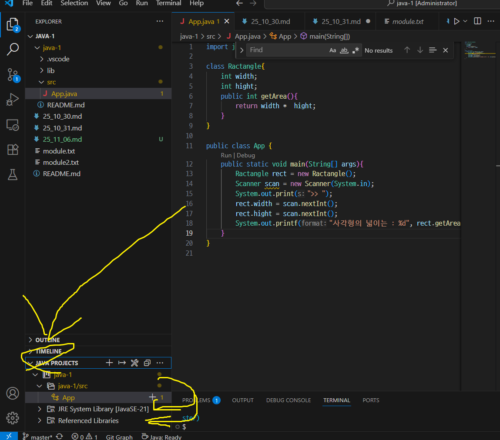

# 윤명근 (202530117)
# 11월 06일 강의


<style>
    /*  */
#bar {
  display: none;
  position: absolute;
  background-color: #8a8a8aff;
  width: 4px;
  height: 292px;
  left: 40px;
  top:196px;
}

#mainTable {
  position: relative;
}

body:has(#mainTable:hover) #bar {
  display: block;
}

span.red{color:#ff0088}
span.green{color:#00ff99}
span.blue{color:#0066cc}
span.yellow{color: #ffff99}
span.puple{color: #9966ff}
span.aqua{color: #96ffffff}

table{
    box-shadow: 5px 5px 20px;
}
</style>

# 모듈과 패키지 개념 자바 패기지 활용

## `` 오늘의 키워드 `` - Java

<table id="mainTable" border="solid 1px black">
    <tr>
        <th><a herf="#">패키지 (Package)</a></th>
        <td>서로 관련된 <span class="red">클래스</span>와 <span class="red">인터페이스</span>를 컴파일한 <ins><span class="green">클래스 파일</span>들을 묶어놓은 <span class="yellow">디렉터리</span></ins>
        </td>
    </tr>
    <tr>
        <th><a herf="#">모듈 (Module)</a></th>
        <td>여러 <span class="red">패키지와 이미지 등</span>의 자원을 모아 놓은 <ins><span class="green">클래스 파일</span>들을 묶어놓은 <span class="yellow">컨테이너</span></ins>
        </td>
    </tr>
    <tr>
        <th><a herf="#">모듈화의 목적<br>(API Fester)</a></th>
        <td>응용프로그램이 실행할 때 <span class="red">꼭 필요한 모듈로만 구성된</span>실행환경을 구축하기 위해 <ins><span class="green">작은 소형 기기에</span>꼭 필요한 모듈로 구성된 <span class="yellow">작은 크기의 실행 이미지를 만들기 위함</span></ins>
        </td>
    </tr>
    <tr>
        <th><a herf="#">Package & module (distinction)</a></th>
        <td><span class="blue">import</span> java.util.<span class="green">Scanner<br><span class="red">java.util</span> : <span class="yellow">컨테이너</span><br><span class="red">java.util</span>.<span class="green">Scanner</span> : <span class="yellow">모듈</span></td>
    </tr>
    <tr>
        <th><a herf="#">Package Save <br>(패키지 세팅)</a></th>
        <td><span class="blue">package</span> java.MySolution.<span class="green">SomeUtil</span><br>package 패키지명.클래스명 [이러면 공유됨]<br>
        [상황에 따라 팀원명.종류.클래스로 접근가능하게 만들기]</td>
    </tr>
</table>

## Package & module (distinction)	import java.util.Scanner
import 가능한 Class 파일들 보는법 [<del>화면 왼쪽 아래 (Java Project)</del>]<br>
<table border="black 1px solid">
    <tr>
        <th><span class="red">기본 제공</span> 패키지</th>
        <td><b>Java Project -> JRE</b></td>
        <td rowspan="2">
        </td>
    </tr>
    <tr>
        <th><span class="green">사용자 정의</span> 패키지</th>
        <td><b>Java Project -> src</b></td>
    </tr>
    <tr>
        <th><span class="blue">Object</span> <br>클래스</th>
        <td>Object.hashCode();<br>Object.toString();</td>
        <td>
        ``` java
        
        ```
        </td>
    </tr>
</table>

